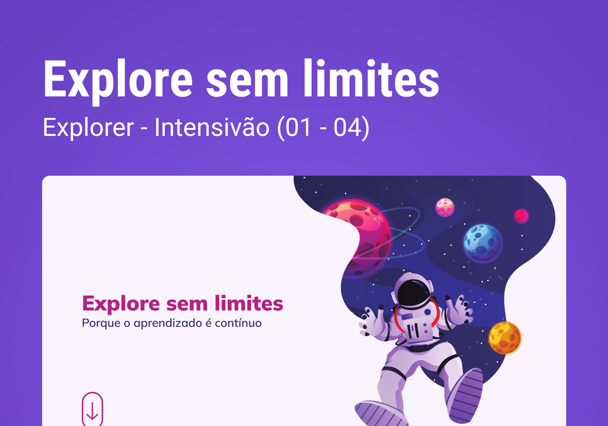

# Explore sem limites
Site responsivo feito pro curso Explorer da Rocketseat.

## Tecnologias usadas:
- HTML  
- CSS  
- Git

## Layout
Esse projeto foi feito a partir [desse](<https://www.figma.com/file/563kgHMxsEy17nCdTJI6JC/Explore-sem-limites/duplicate?type=design&node-id=158-677&mode=design>) layout do figma.
 
